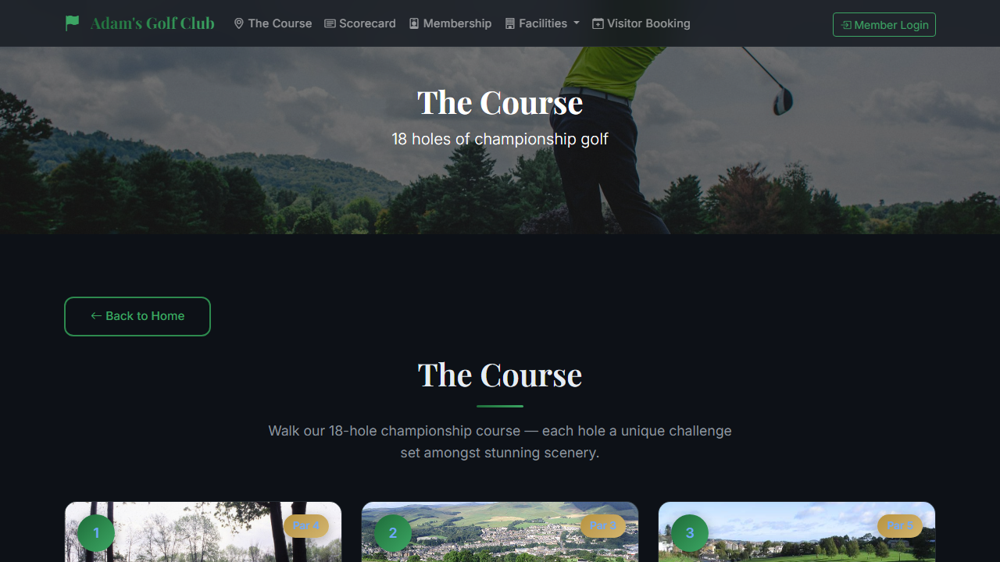
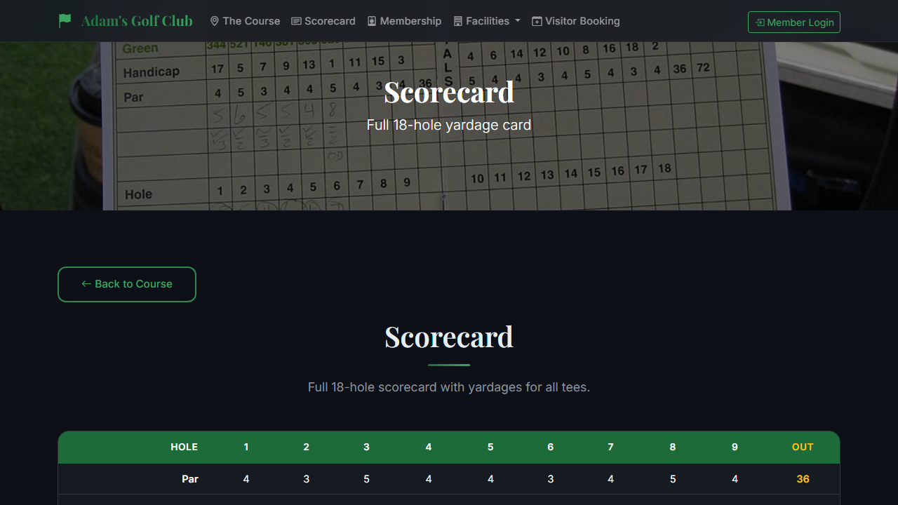
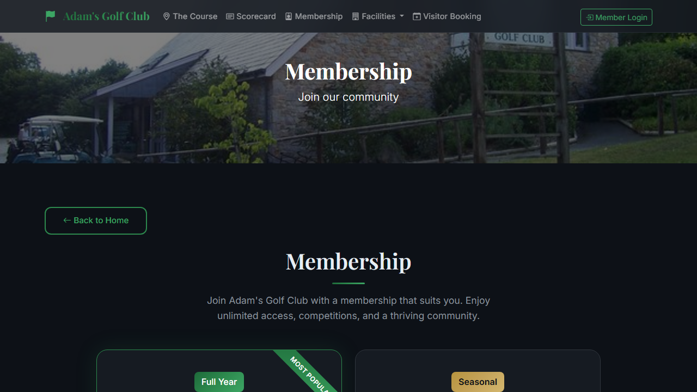
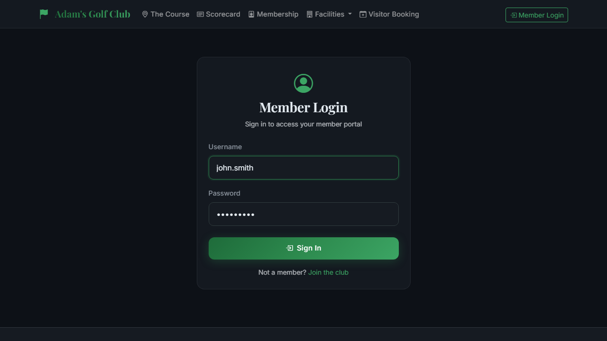
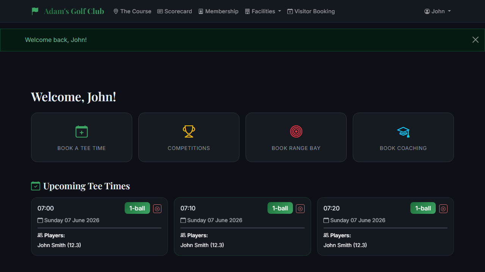
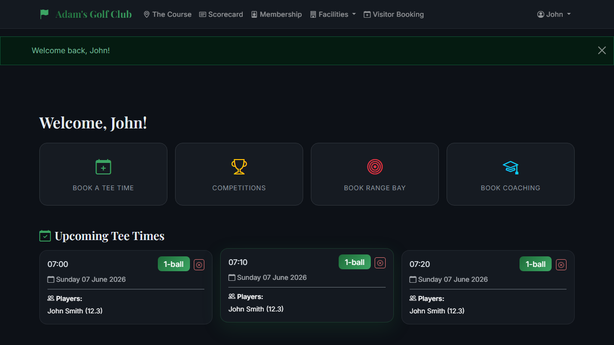
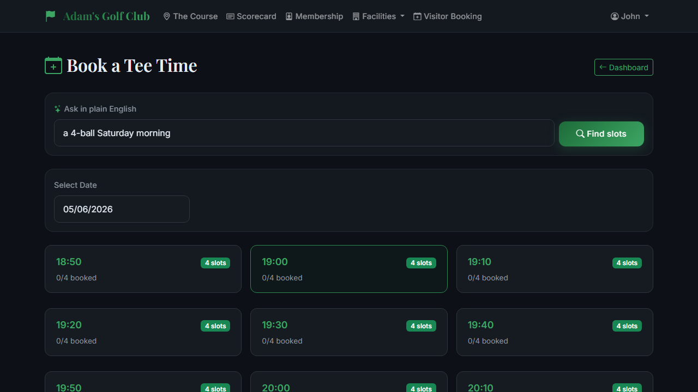
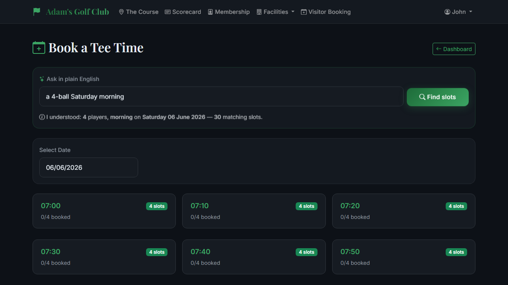
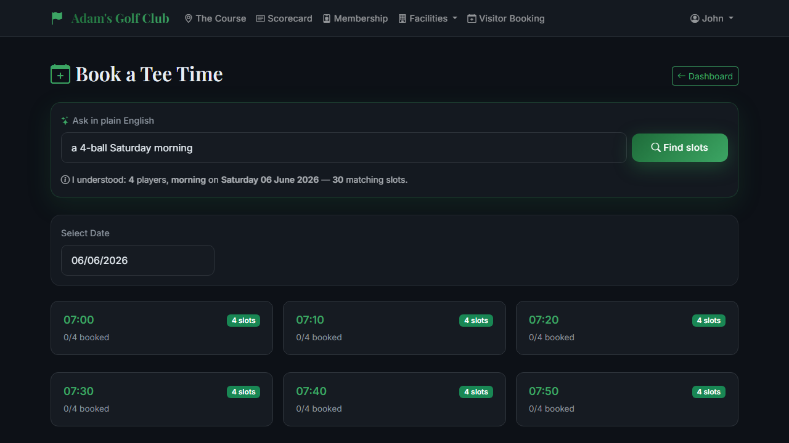

# Exploratory probe — golf-web-app UI tours

_Run: 2026-06-05 • base url: `http://localhost:5000` • model: `qwen2.5:32b-instruct-q4_K_M`_

## Summary

| Tour | Steps | Outcome | Worst category | Failed steps |
|---|---|---|---|---|
| `public-pages` | 4 | finished | `js_error` | 0 |
| `member-login-dashboard` | 4 | finished | `dead_end` | 0 |
| `booking-assistant` | 5 | hit cap | `dead_end` | 0 |

## Tour — `public-pages`

**Goal:** Browse the public marketing surface of the golf club site. The visitor is not logged in. From the homepage, navigate to at least two other public pages (course overview, scorecard, membership, contact) to verify they load cleanly and the navigation links resolve. Stay logged out throughout.

**Starting URL:** `/` • **Max steps:** 6

**Outcome:** agent finished — The goal of browsing at least two other public pages has been met, and there are no further interactive elements on the current contact page that lead to additional public content.

### Step 1 — `navigate` (OK)

**Category:** `expected` • **Severity:** —

**Decision rationale:** Navigating to the course overview page as it is one of the public pages that needs to be verified.

**Judge rationale:** The step executed without error, the navigation to '/course' was successful, and it advanced the tour goal by verifying that a public page loads cleanly.

**Action:** `navigate` target=`/course` value=`None`

**After:** URL=`http://localhost:5000/course` • title=`The Course — Adam's Golf Club` • elapsed `45 ms`

### Step 2 — `navigate` (OK)

**Category:** `expected` • **Severity:** —

**Decision rationale:** Navigating to the scorecard page to verify it loads cleanly and to continue exploring public pages.

**Judge rationale:** The step executed without error, the scorecard page loaded cleanly at http://localhost:5000/course/scorecard, and there were no console errors or network issues.

**Action:** `navigate` target=`/course/scorecard` value=`None`

**After:** URL=`http://localhost:5000/course/scorecard` • title=`Scorecard — Adam's Golf Club` • elapsed `41 ms`

### Step 3 — `navigate` (OK)

**Category:** `expected` • **Severity:** —

**Decision rationale:** Navigating to the membership page to verify it loads cleanly and progress through public pages as per the tour goal.

**Judge rationale:** The step executed without error, the membership page loaded cleanly at http://localhost:5000/membership, and there were no console errors or network issues. This aligns with the tour goal of verifying that public pages load correctly.

**Action:** `navigate` target=`/membership` value=`None`

**After:** URL=`http://localhost:5000/membership` • title=`Membership — Adam's Golf Club` • elapsed `26 ms`

### Step 4 — `navigate` (OK)

**Category:** `js_error` • **Severity:** med

**Decision rationale:** To continue browsing public pages and verify that navigation links resolve, I will navigate to the contact page as it is another important public section of the site.

**Judge rationale:** Although the navigation to '/contact' succeeded, there is a JavaScript console error indicating that a resource failed to load due to a 404 NOT FOUND response from the server. This suggests an issue with loading essential assets for the page, which could affect its functionality or appearance.

**Action:** `navigate` target=`/contact` value=`None`

**After:** URL=`http://localhost:5000/contact` • title=`` • elapsed `8 ms`

**Console errors:**
  - `error: Failed to load resource: the server responded with a status of 404 (NOT FOUND)`

## Tour — `member-login-dashboard`

**Goal:** A returning member arrives at the login page and signs in to reach the member dashboard. Fill in the username and password fields with the supplied seed credentials, submit the form, and verify the dashboard renders without errors. Do not log out.

**Starting URL:** `/auth/login` • **Max steps:** 5

**Outcome:** agent finished — The dashboard has rendered without errors, and the member is signed in as John. The goal of reaching the member dashboard post-login is achieved.

### Step 1 — `fill` (OK)

**Category:** `expected` • **Severity:** —

**Decision rationale:** Filling in the username field with the seed credentials is the first step towards logging in.

**Judge rationale:** The step executed without error and the username field was successfully filled with 'john.smith'. The page URL and interactive elements indicate that we are still on the login page, which is expected after filling in just the username.

**Action:** `fill` target=`#username` value=`john.smith`

**After:** URL=`http://localhost:5000/auth/login` • title=`Login — Adam's Golf Club` • elapsed `17 ms`

### Step 2 — `fill` (OK)

**Category:** `dead_end` • **Severity:** med

**Decision rationale:** Filling in the password field with the seed credentials advances towards logging in.

**Judge rationale:** The step intended to fill the password field and advance towards logging in, but the page URL remains at `http://localhost:5000/auth/login` with all interactive elements still present, indicating that the form submission did not occur or was unsuccessful. This leaves the tour unable to progress to the next step.

**Action:** `fill` target=`#password` value=`Password1`

**After:** URL=`http://localhost:5000/auth/login` • title=`Login — Adam's Golf Club` • elapsed `5 ms`

### Step 3 — `click` (OK)

**Category:** `expected` • **Severity:** —

**Decision rationale:** Clicking the 'Sign In' button will submit the login form with the provided credentials and should navigate to the member dashboard.

**Judge rationale:** The step executed without error, the 'Sign In' button was successfully clicked, and it navigated to the expected member dashboard at http://localhost:5000/member/dashboard.

**Action:** `click` target=`#sign-in-button` value=`None`

**After:** URL=`http://localhost:5000/member/dashboard` • title=`Dashboard — Adam's Golf Club` • elapsed `217 ms`

### Step 4 — `observe` (OK)

**Category:** `expected` • **Severity:** —

**Decision rationale:** The dashboard has rendered without errors, as evidenced by the presence of interactive elements specific to the member dashboard page. The goal is reached.

**Judge rationale:** The step executed without error and the dashboard rendered with interactive elements specific to the member dashboard page, indicating that the tour goal was successfully advanced.

**Action:** `observe` target=`None` value=`None`

**After:** URL=`http://localhost:5000/member/dashboard` • title=`Dashboard — Adam's Golf Club` • elapsed `208 ms`

## Tour — `booking-assistant`

**Goal:** A logged-in member uses the natural-language booking assistant on the booking page. Type a free-text request such as 'a 4-ball Saturday morning' into the assistant input and submit. Verify the assistant returns plausible candidate slots. STOP at the suggestion phase — do not click a slot to confirm a booking (state mutation is out of scope for v1).

**Starting URL:** `/member/book-tee-time` • **Max steps:** 5

**Outcome:** hit the 5-step cap without the agent finishing.

### Step 1 — `fill` (OK)

**Category:** `expected` • **Severity:** —

**Decision rationale:** Filling in the assistant input with a free-text request as required by the goal.

**Judge rationale:** The step executed without error and the intended action was completed successfully, filling in the assistant input with 'a 4-ball Saturday morning'. The page state after the step aligns with the tour goal of using the natural-language booking assistant on the booking page.

**Action:** `fill` target=`#assist_text` value=`a 4-ball Saturday morning`

**After:** URL=`http://localhost:5000/member/book-tee-time` • title=`Book Tee Time — Adam's Golf Club` • elapsed `10 ms`

### Step 2 — `click` (OK)

**Category:** `dead_end` • **Severity:** med

**Decision rationale:** Clicking the 'Find slots' button will submit the free-text request to the booking assistant and show plausible candidate slots, which is the next step in the goal.

**Judge rationale:** Although the click action on '#assist-button' succeeded, the page state after the step does not show any plausible candidate slots as expected. The interactive elements visible post-click do not indicate that the booking assistant has returned any suggestions, which is a critical part of advancing the tour goal.

**Action:** `click` target=`#assist-button` value=`None`

**After:** URL=`http://localhost:5000/member/book-tee-time/assist` • title=`Book Tee Time — Adam's Golf Club` • elapsed `5272 ms`

### Step 3 — `observe` (OK)

**Category:** `dead_end` • **Severity:** med

**Decision rationale:** The page has loaded after submitting the request, and we need to verify if plausible candidate slots are returned by the assistant without clicking on any slot to confirm a booking.

**Judge rationale:** The step intended to observe if plausible candidate slots were returned by the assistant, but the interactive elements visible after the step do not indicate that any slots have been suggested. The page still shows input fields and buttons for submitting a request, suggesting that the submission did not result in slot suggestions as expected.

**Action:** `observe` target=`None` value=`None`

**After:** URL=`http://localhost:5000/member/book-tee-time/assist` • title=`Book Tee Time — Adam's Golf Club` • elapsed `215 ms`

### Step 4 — `observe` (OK)

**Category:** `expected` • **Severity:** —

**Decision rationale:** The page has rendered with the booking suggestions, and we need to verify that plausible candidate slots are returned without clicking on any of them to confirm a booking.

**Judge rationale:** The step executed without error and the page rendered with the booking suggestions as intended, aligning with the tour goal of verifying plausible candidate slots are returned.

**Action:** `observe` target=`None` value=`None`

**After:** URL=`http://localhost:5000/member/book-tee-time/assist` • title=`Book Tee Time — Adam's Golf Club` • elapsed `208 ms`

### Step 5 — `observe` (OK)

**Category:** `expected` • **Severity:** —

**Decision rationale:** The page has already been observed in previous steps, and we need to verify if plausible candidate slots are displayed as a result of the assistant's processing without clicking any further.

**Judge rationale:** The step executed without error and the page state is as expected, showing all necessary interactive elements including the booking assistant input and buttons. The tour goal of observing plausible candidate slots after using the natural-language booking assistant is aligned with this step.

**Action:** `observe` target=`None` value=`None`

**After:** URL=`http://localhost:5000/member/book-tee-time/assist` • title=`Book Tee Time — Adam's Golf Club` • elapsed `211 ms`

---

_Generated by `explore_agent.ui_run` (phase 12 v1 v3 — adaptive). Advisory — findings are a starting point for a reviewer, not a gate. See [`explore_agent/README.md`](../../README.md)._
